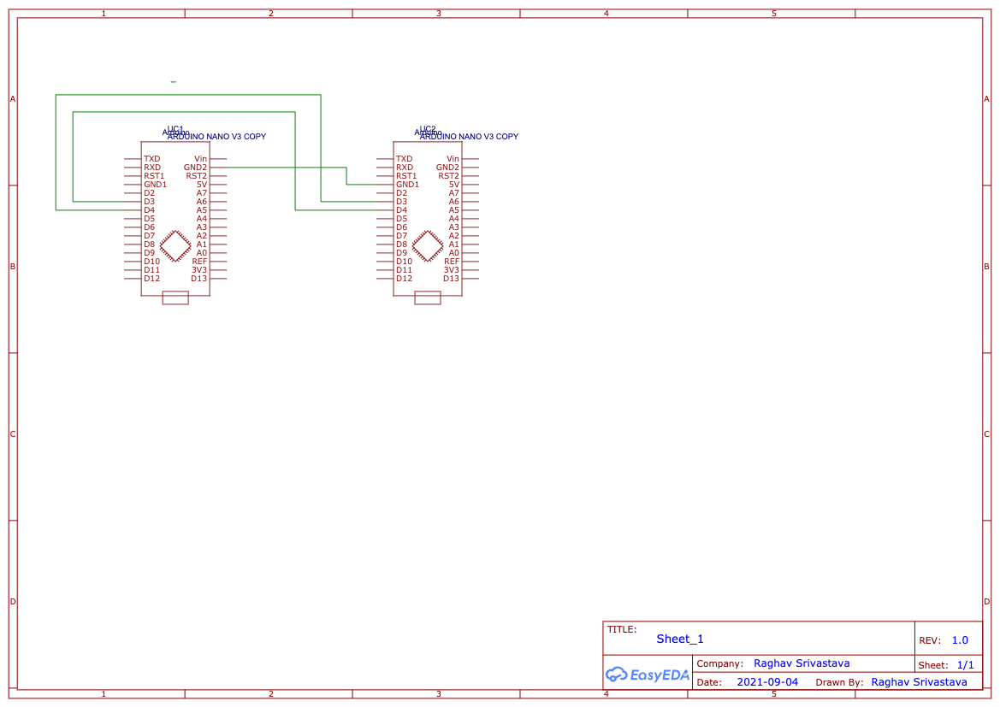

# ABOUT THE PROJECT

Implement end to end encrypted communication between two Arduino Nanos(or any Arduino supported microcontrollers/boards) using UART. All code is written from scratch with no libraries used for encryption.

# Build

To make the project connect the circuit as per the schematic, connect both the ARDUINO boards to your computer, compile and upload the code to each board then start two serial monitor sessions.

Watch the [video](https://youtu.be/SntnbioGwOQ) for getting the full idea of the project

Or if you have no idea about Diffie Hellman key exchange algorithm watch this [video](https://youtu.be/Bkgfk1p_pps) first[Video/Audio Quality not the best, sorry!]

